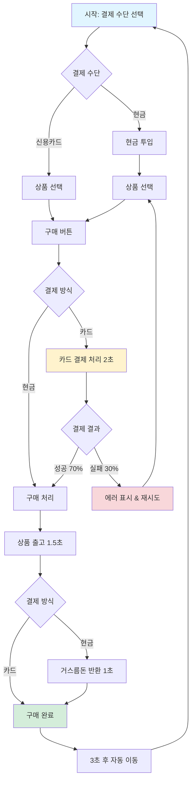
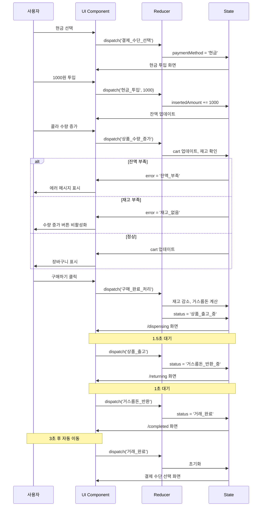

# 🧃 자동 판매기 (Vending Machine)

React와 TypeScript로 구현한 자동 판매기 시뮬레이션 애플리케이션

> **📝 문서 작성**: 이 README는 GPT의 파일 업로드 및 소스코드 분석을 통해 작성된 문서입니다. 프로젝트의 구조, 상태 관리 패턴, 화면 플로우 등을 자동으로 분석하여 생성되었습니다.

## 📚 목차

- [기술 스택](#-기술-스택)
- [사용 방법](#-사용-방법)
- [상태 관리 (Reducer)](#-상태-관리-reducer)
- [화면 플로우](#-화면-플로우)
- [예외 상황 처리](#-예외-상황-처리)
- [프로젝트 구조](#-프로젝트-구조)

---

## 🛠 기술 스택

### Core

- **React 19** - UI 라이브러리
- **TypeScript 5.9** - 타입 안정성
- **React Router 7** - 라우팅

### Styling

- **Tailwind CSS 4** - 유틸리티 CSS 프레임워크

### Build Tools

- **Vite 7** - 빌드 도구
- **ESLint + Prettier** - 코드 품질 관리

### State Management

- **React Context + useReducer** - 전역 상태 관리
- Flux 패턴 기반 단방향 데이터 흐름

---

## 🚀 사용 방법

### 설치 및 실행

```bash
# 의존성 설치
npm install

# 개발 서버 실행
npm run dev

# 프로덕션 빌드
npm run build

# 빌드 결과 미리보기
npm run preview
```

### 사용 흐름

1. **결제 수단 선택** - 현금 또는 신용카드 선택
2. **현금 투입** (현금 결제 시) - 100원, 500원, 1000원, 5000원, 10000원
3. **상품 선택** - 콜라, 생수, 커피 중 선택 및 수량 조절
4. **구매 확인** - 구매 처리 및 상품 출고
5. **거스름돈 반환** (현금 결제 시) - 잔액 반환
6. **거래 완료** - 3초 후 자동으로 초기 화면으로 이동

---

## 🔄 상태 관리 (Reducer)

### State 구조

```typescript
interface VendingMachineState {
  products: Product[]; // 상품 목록 (재고 포함)
  currentTransaction: Transaction; // 현재 거래 정보
}

interface Transaction {
  id: string;
  paymentMethod: '현금' | '신용카드' | null;
  insertedAmount: number; // 투입 금액
  purchaseAmount: number; // 구매 금액
  changeAmount: number; // 거스름돈
  cart: CartItem[]; // 장바구니
  status: TransactionStatus; // 거래 상태
  error: ErrorType | null; // 에러 상태
}
```

### Action 타입

> **참고**: Action 도메인별 기능, 타입 명명은 GPT를 활용하여 직관적이고 명확한 이름으로 설계하였습니다. 이를 통해 코드의 가독성과 도메인 이해도를 높였습니다.

#### 1. 결제 관련

```typescript
'결제_수단_선택'; // 현금 or 카드 선택
'현금_투입'; // 현금 금액 투입
'카드_결제_처리_시작'; // 카드 결제 시작
'신용카드_결제_성공'; // 카드 결제 성공
'신용카드_결제_실패'; // 카드 결제 실패 (재시도 가능)
```

#### 2. 상품 선택 관련

```typescript
'상품_수량_증가'; // 장바구니 상품 수량 +1
'상품_수량_감소'; // 장바구니 상품 수량 -1
'금액_추가'; // 현금 추가 투입으로 이동
```

#### 3. 거래 흐름 관련

```typescript
'구매_완료_처리'; // 구매 시작 (재고 감소, 거스름돈 계산)
'상품_출고'; // 상품 배출 처리
'거스름돈_반환'; // 거스름돈 반환 처리
'거래_완료'; // 거래 종료 및 초기화
'거래_취소'; // 거래 취소 및 환불
```

### 거래 상태 (TransactionStatus)

```typescript
'대기_상태'; // 초기 상태
'결제_수단_선택_중'; // 결제 수단 선택 화면
'현금_투입_중'; // 현금 투입 화면
'신용카드_처리_중'; // 카드 결제 처리 중 (오버레이)
'상품_선택_중'; // 상품 선택 화면
'구매_처리_중'; // 구매 처리 진행 중
'상품_출고_중'; // 상품 배출 중
'거스름돈_반환_중'; // 거스름돈 반환 중
'거래_완료'; // 거래 완료
'거래_취소'; // 거래 취소
```

---

## 🗺️ 화면 플로우

### 전체 플로우 다이어그램



### 상세 플로우

#### 1️⃣ 현금 결제 플로우

```
[결제 수단 선택]
       ↓
[현금 투입]
  - 100원, 500원, 1000원, 5000원, 10000원 버튼
  - 현재 투입 금액 표시
  - 상품 선택 버튼 (최소 금액 이상일 때 활성화)
  - 현금 반환 버튼
       ↓
[상품 선택]
  - 장바구니에 상품 추가/제거
  - 실시간 잔액 확인
  - 잔액 부족 시 "금액 추가" 버튼
  - 재고 부족 시 수량 증가 불가
       ↓
[구매하기] 클릭
       ↓
[처리 중] (0.8초)
       ↓
[상품 출고] (1.5초)
       ↓
[거스름돈 반환] (1초)
  - 반환 금액 표시
  - 구매한 상품 목록
       ↓
[구매 완료] (3초 카운트다운)
       ↓
[초기 화면으로 자동 이동]
```

#### 2️⃣ 카드 결제 플로우

```
[결제 수단 선택]
       ↓
[상품 선택] (잔액 Infinity)
  - 가격 제한 없이 상품 선택 가능
  - 재고만 확인
       ↓
[카드 결제] 클릭
       ↓
[카드 결제 처리 중] (2초 - 오버레이)
  - 로딩 스피너 표시
  - 70% 확률로 성공
  - 30% 확률로 실패
       ↓
[결제 성공] → [상품 출고] (1.5초)
       ↓
[구매 완료] (3초 카운트다운)
       ↓
[초기 화면으로 자동 이동]

[결제 실패] → [에러 메시지 & 재시도 버튼]
       ↓
[상품 선택 화면으로 복귀]
```

### 이벤트 처리 시각화



---

## ⚠️ 예외 상황 처리

### 1. 재고 관리

| 상황      | 처리 방법                            |
| --------- | ------------------------------------ |
| 재고 0개  | "품절" 표시, 수량 증가 버튼 비활성화 |
| 재고 부족 | 현재 수량 >= 재고일 때 증가 불가     |
| 다중 구매 | 장바구니에서 각 상품별 재고 확인     |

### 2. 금액 관리 (현금 결제)

| 상황           | 처리 방법                                           |
| -------------- | --------------------------------------------------- |
| 잔액 부족      | \`error: '잔액\_부족'\` 설정, "금액 추가" 버튼 표시 |
| 최소 금액 미달 | 상품 선택 버튼 비활성화, 필요 금액 표시             |
| 거스름돈 계산  | \`insertedAmount - purchaseAmount\`                 |

### 3. 카드 결제

| 상황            | 처리 방법                                         |
| --------------- | ------------------------------------------------- |
| 결제 실패 (30%) | \`error: '신용카드*인증*실패'\`, 재시도 버튼 표시 |
| 결제 성공 (70%) | 상품 출고 진행                                    |
| 처리 중         | 오버레이 로딩 스피너, 사용자 액션 차단            |

### 4. 거래 취소

| 상황              | 처리 방법                                          |
| ----------------- | -------------------------------------------------- |
| 현금 투입 후 취소 | 투입한 현금 전액 반환, 거스름돈 반환 화면으로 이동 |
| 카드 선택 후 취소 | 즉시 초기 화면으로 이동                            |
| 상품 선택 중 취소 | 현재 장바구니 내역 유지한 채 취소                  |

### 5. 상태 동기화

```typescript
// 상태 기반 네비게이션으로 메모리 누수 방지
useEffect(() => {
  if (status === '상품_출고_중') {
    navigate('/dispensing');
  }
}, [currentTransaction, navigate]);
```

---

## 📁 프로젝트 구조

```
src/
├── features/                    # 기능별 컴포넌트
│   ├── insert-cash/            # 현금 투입 기능
│   │   └── ui/
│   │       └── cash-inserter.tsx
│   ├── select-payment/         # 결제 수단 선택
│   │   └── ui/
│   │       └── payment-selector.tsx
│   └── select-product/         # 상품 선택
│       └── ui/
│           └── product-selector.tsx
│
├── pages/                       # 페이지 컴포넌트
│   ├── payment-selection-page.tsx    # 결제 수단 선택
│   ├── cash-insert-page.tsx          # 현금 투입
│   ├── product-selection-page.tsx    # 상품 선택
│   ├── processing-page.tsx           # 처리 중 (공통)
│   └── completion-page.tsx           # 완료 화면
│
├── providers/                   # 상태 관리
│   └── vending-machine/
│       ├── hooks/
│       │   └── use-vending-machine.ts
│       ├── lib/
│       │   ├── reducer.ts              # 메인 리듀서
│       │   ├── cart-handlers.ts        # 장바구니 핸들러
│       │   ├── payment-handlers.ts     # 결제 핸들러
│       │   └── transaction-handlers.ts # 거래 핸들러
│       ├── types/
│       │   └── index.ts               # 타입 정의
│       └── ui/
│           └── vending-machine-provider.tsx
│
├── shared/                      # 공통 모듈
│   ├── lib/
│   │   ├── format.ts           # 포맷 유틸
│   │   ├── payment.ts          # 결제 로직
│   │   ├── products.ts         # 상품 데이터
│   │   └── transaction.ts      # 거래 유틸
│   ├── types/
│   │   └── index.ts           # 공통 타입
│   └── ui/
│       ├── completion-message.tsx  # 완료 메시지
│       ├── loading-spinner.tsx     # 로딩 스피너
│       └── header.tsx              # 헤더
│
├── App.tsx                      # 라우팅 설정
└── main.tsx                     # 앱 진입점
```

### 주요 파일 설명

#### State Management

- **reducer.ts** - 모든 액션을 처리하는 중앙 리듀서
- **cart-handlers.ts** - 장바구니 로직 (수량 증가/감소, 재고/잔액 검증)
- **payment-handlers.ts** - 결제 수단 선택, 현금 투입, 카드 결제
- **transaction-handlers.ts** - 구매 처리, 출고, 반환, 완료

#### Routing

```typescript
/                    → PaymentSelectionPage    (결제 수단 선택)
/cash/insert         → CashInsertPage          (현금 투입)
/product             → ProductSelectionPage    (상품 선택)
/processing          → ProcessingPage          (구매 처리 중)
/dispensing          → ProcessingPage          (상품 출고 중)
/returning           → ProcessingPage          (거스름돈 반환 중)
/completed           → CompletionPage          (완료)
```

---

## 🎯 핵심 특징

### 1. 타입 안정성

- 모든 액션, 상태, Props에 TypeScript 타입 지정
- Discriminated Union으로 액션 타입 안전성 보장

### 2. 단방향 데이터 흐름

- Flux 패턴 기반 상태 관리
- 예측 가능한 상태 변경

### 3. 관심사의 분리

- 핸들러를 기능별로 분리 (cart, payment, transaction)
- UI와 비즈니스 로직 분리

### 4. 사용자 경험

- 실시간 피드백 (잔액, 재고, 에러)
- 로딩 상태 표시
- 카운트다운 및 자동 이동

### 5. 에러 처리

- 세분화된 에러 타입
- 사용자 친화적 에러 메시지
- 복구 가능한 에러 (재시도, 금액 추가)

---
